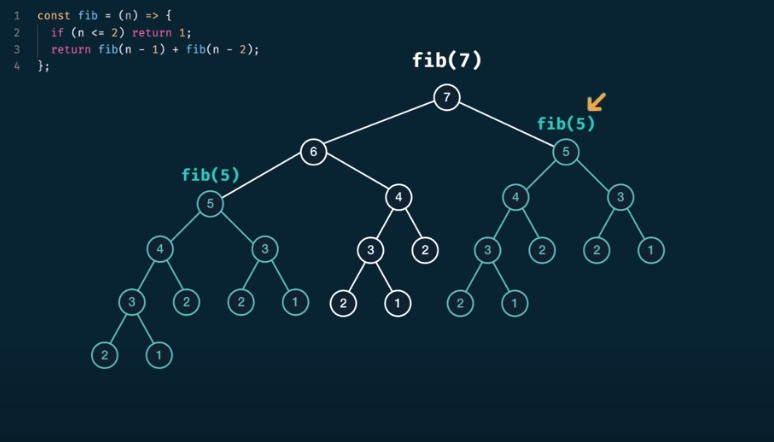
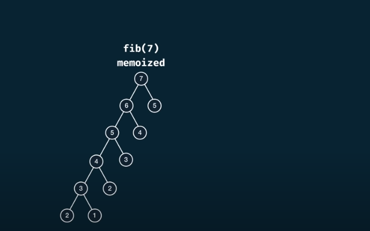

The non-memoized fibonacci solution incurs on a 2^n time complexity and n space complexity leaving aside constants. As we can see in the image attached the higher the number the more duplicated computations we incur on.

If we opt for memoization we could go from a 2^n to n time complexity as we can see in the picture

